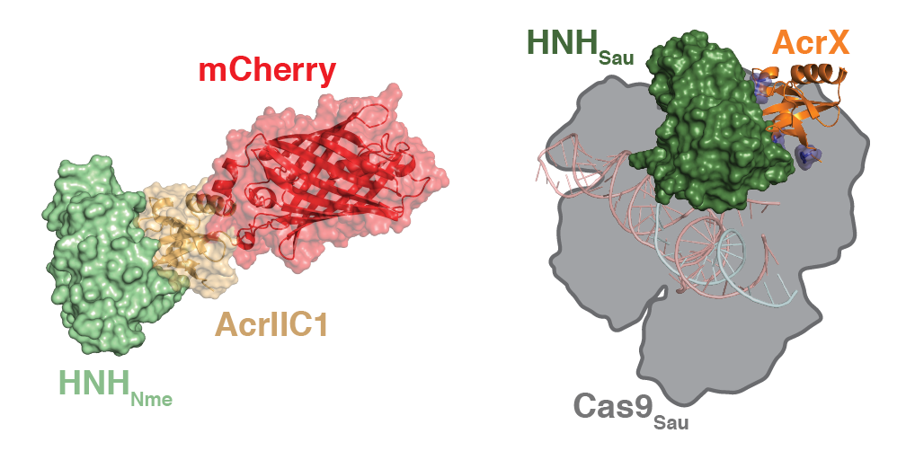

# Computational design of anti-CRISPR proteins with improved inhibition potency and expanded specificity.
Repository for the computational part of the paper:

Jan Mathony, Zander Harteveld, Carolin Schmelas, Julius Upmeier zu Belzen, Sabine Aschenbrenner, Mareike D Hoffmann, Christina Stengl, Andreas Scheck, Stephane Rosset, Dirk Grimm, Roland Eils, Bruno E Correia, Dominik Niopek. 2019. *Computational design of anti-CRISPR proteins with improved inhibition potency and expanded specificity*.

## AcrX design and analysis protocols
We applied structure-based engineering on AcrIIC1, a broad-spectrum inhibitor of type II-C CRISPR systems, to improve its efficacy and expand its specificity. Fusing an exogenous protein domains into AcrIIC1 dramatically enhances inhibition of the natural Neisseria meningitidis Cas9 target. Furthermore, using structure-guided design, we converted AcrIIC1 into AcrX, a potent inhibitor of the type II-A CRISPR-Cas9 from Staphylococcus aureus widely applied for in vivo genome editing. The lead variant AcrX corresponds to AcrIIC1 with point mutations N2F/D14Q/A47I.

**interface/**
Contains scripts related to the generation of AcrX.

**mcherry/** 
Contains scripts related to the generation of AcrIIC1-mCherry chimeras. 

**in/** 
Contains the pdb files for the Acr (based on PDB 5VGB) and mCherry (based on PDB 4ZIN), as well as the blueprint files for the remodel application.

**scripts/**
Contains different scripts used troughout this work.

**experimental/**
Contains experimental data and its analysis pipeline in form of a notebook.

*Rosetta version used for design and scoring: 2018.18.post.dev+132.HEAD.ab819933844 ab819933844e0ed13e59fce789cf06bd09350875*
